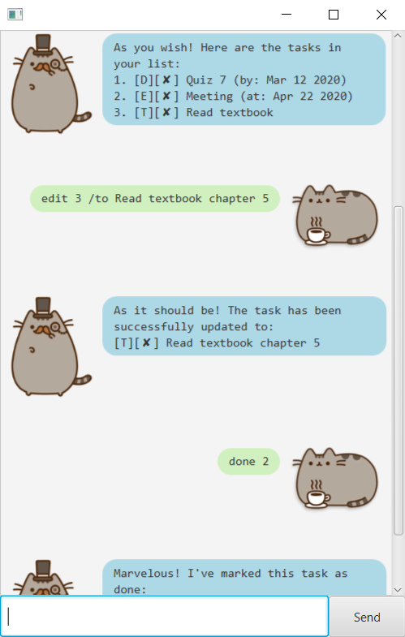

# User Guide

## Interface

## Overview
Ducat is an task management chatbot (AKA catbot) that allows you to note down your tasks and manage them accordingly.
You can ask Ducat to create new tasks and tick them off when completed. 
You can edit, delete, and search through your tasks as you wish.

## Features and Usage

### 1.  `todo` 
Add a todo to your tasks list.
    
    todo <description> 
    todo Read book

### 2.  `deadline` 
Add a deadline to your tasks list.
You can specify dates for deadlines.

    deadline <description> /by <yyyy-mm-dd>
    deadline Assignment /by 2020-03-12
    
### 3. `event`
Add an event to your tasks list.
You can specify dates for events.

    event <description> /by <yyyy-mm-dd>
    event Meeting /by 2020-04-12

### 4. `done`
Marks a task as done.

    done <task number>
    done 4
    
### 5.  `edit`
Edit the description of a task (todo, deadline, or event)

    edit <task number> /to <new description>
    edit 1 /to Read textbook

### 6. `delete` 
Removes a task from the list.

    delete <task number>
    delete 2
    
### 7. `find` 
Search the list for tasks containing a keyword.

    find <keyword>
    find book
    
### 8. `list` 
List all of your tasks.

    list

### 9. `bye`
Says goodbye.

    bye
